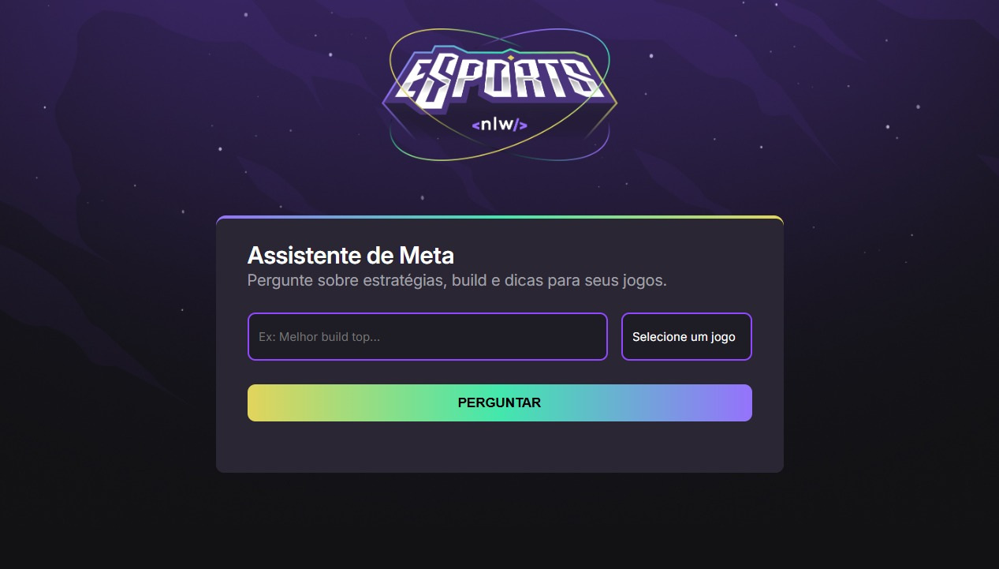

## Projeto Assistente de Meta

## ✨ Sobre o Projeto

Este projeto é um assistente de meta onde se pode perguntar estrategias, builds e dicas dos seguintes jogos: CS:GO, Fortnite, League of legends e Valorant. As respostas são geradas através de uma inteligencia artifical integrada ao projeto. Ele foi desenvolvido durante o evento do NLW-20 Agents, organizado pela Rocketseat.  

## 💻 Tecnologias Utilizadas

- HTML
- CSS
- JavaScript

## 🔗 Link

- URL Site: [https://leeticia-araaujo.github.io/assistente-de-meta/index.html](https://leeticia-araaujo.github.io/assistente-de-meta/index.html) 